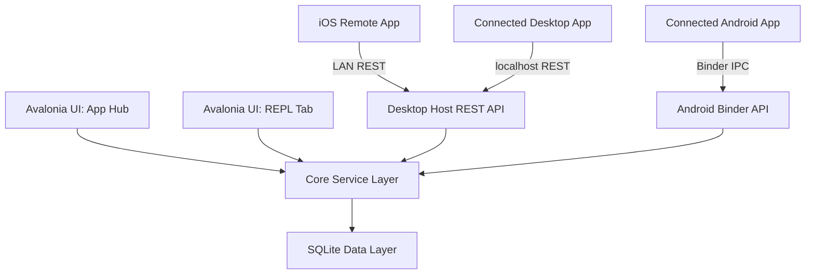

# Architecture

## Component Diagram

## Data Flow
1. **Core Service Layer**: Centralized logic interface for Player, Points, Inventory, Permissions, Sync, and App Registry management.
2. **Data Layer**: SQLite storage implementation using Dapper for mapping queries. Passwords and API keys are stored as BCrypt hashes.
3. **Platform API Layers**: 
   - **Linux/Desktop/iOS**: Uses an ASP.NET Core Kestrel server to serve REST APIs over the network, validated by API Key headers.
   - **Android**: Uses Android Binder IPC where authentication relies on OS-enforced Caller UID.

## Technology Decisions
- **Avalonia UI**: Chosen for cross-platform support with a unified codebase (Linux & Android).
- **SQLite**: Local relational database optimal for embedded mobile and desktop setups.
- **REST / Kestrel**: Robust web server for inter-device LAN communication.
- **BCrypt**: Used to securely hash and store API keys.

## Open Design Decisions
- Conflict resolution relies strictly on **last-write-wins** logic.
- Coins and EXP are tracked using unified entity structures but could potentially merge completely in future UX iterations.
- Avalonia Android UI targets thin wrapper logic; adjustments to the mobile UI paradigms might be necessary depending on user feedback.
